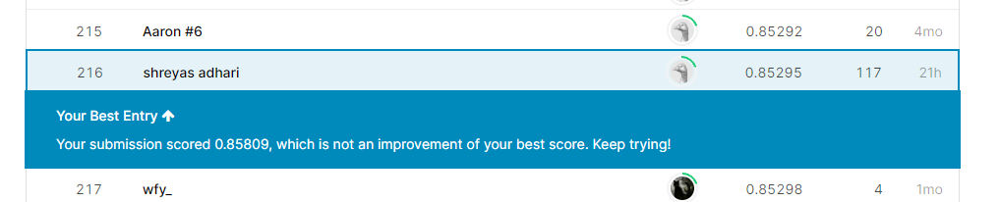

# [Predict-future-sales](https://www.kaggle.com/competitions/competitive-data-science-predict-future-sales)

## Objective 
- Objective is to predict the sales at a given store for a particular item for a month .
- Sales refers to the number of items sold multiplied by its unit price.

## Data Preprocessing
- Data provided is a timeseries data consisting of sales occuring at various stores in Russia from `Nov 2013` to `Oct 2015`.
- Missing values were imputed using mean for a particular item.
- `Product id` or `Shop id` present only in train set were dropped.
- Text columns were preprocessed by `lowercasing`, `removing special characters`, `remove leading and trailing white space` and `replace double spaces with single spaces`.
- Memory usage was reduced by compressing the dataframe as much as possible.
- `TimeSeriesSplit` was used for cross validation.

## Feature Engineering
- `lgbm_dataset.ipynb` notebook is used to preprocess dataset given and create new features.
- `Mean encodings` are used extensively along with `medain encodings` and `max encodings`. These helped the model a lot.
- `Lagging Features` were constructed for 1 month.
- `Weekly Sales`, `Counts` and `Groupby Features` were also constructed.

## Feature Selection and Hyperparamter Optimisation
- Features were selected according to importance given to them by `LightGBM regression models`.
- `Optuna` was used for hyperparamter optimisation. Focus was to improve model performance as well as to limit overfitting.
- `hyperopt_lgbm_1.ipynb` notebook contains code for hyperparameter optimisation.

## Training
- `LightGBM`, `Xgboost` and `Catboost` models were trained. Simple Models were avoided as they gave poor results.

## Results
- `RMSE` of `0.85295` was achieved.
- `Lightgbm` model outperformed `Xgboost` and `CatBoost` as well as ensembles of the models.
-  `Public Leaderboard` Position of `216` was achieved.

